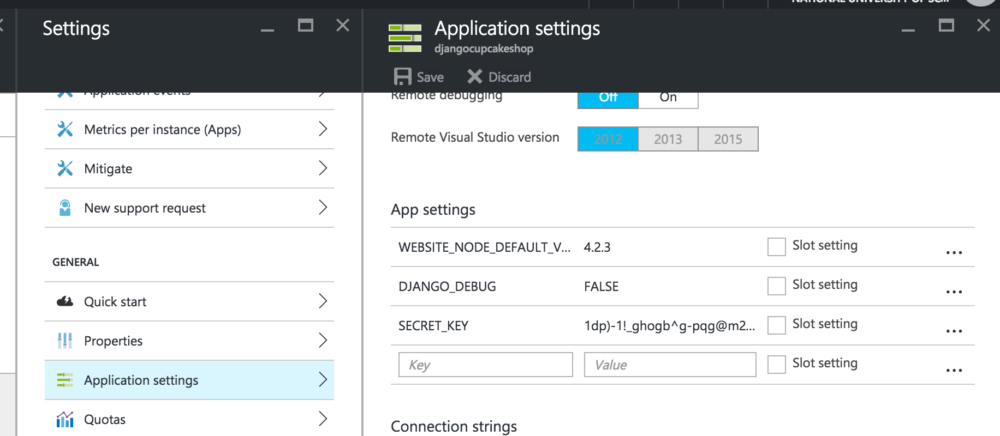

# Azure
> Relevant branch `azure`

Azure is Microsoft's cloud server. We can deploy our Cupcake site on Azure too. You can create a free account and try out Azure. Our coaches have already prepared a step-by-step guide for deploying a Django site on Azure.

English Tutorial : [https://jinpark-dg.gitbooks.io/django-girls-azure/content/](https://jinpark-dg.gitbooks.io/django-girls-azure/content/)
Korean Tutorial : [https://github.com/askdjango/azure-webapp-django-setup](https://github.com/askdjango/azure-webapp-django-setup)

#TO-DO (English)
After you are done with **Before we start** part of English [Tutorial]([https://jinpark-dg.gitbooks.io/django-girls-azure/content/](https://jinpark-dg.gitbooks.io/django-girls-azure/content/))
### web.config
In `web.config` file replace the following contents 

```python
<add key="DJANGO_SETTINGS_MODULE" value="mysite.settings" />
```

with 

```python
<add key="DJANGO_SETTINGS_MODULE" value="djangocupcakeshop.settings" />
```

Add media files setting code below `<add input="{REQUEST_URI}" pattern="^/static/.*" ignoreCase="true" negate="true" />`.

```python

<add input="{REQUEST_URI}" pattern="^/media/.*" ignoreCase="true" negate="true" />
          </conditions>
```

Make sure you have `requirements.txt` file with following contents

```bash
Django==1.9.8
Pillow==3.0.0

```

## settings.py

We have to slightly change our `settings.py` to allow Azure site in `ALLOWED_HOSTS` as follows

```python

if DEBUG:
    ALLOWED_HOSTS = ['*']
else:
    ALLOWED_HOSTS = ['djangocupcakeshop.azurewebsites.net']
    
```

 Go back to tutorial and finish all the **Deploying** steps

### Environment variables
There is one more thing we have to do. That is to add `Environment variables` as we did on PythonAnywhere. Click on `settings` of your Azure web app. Then click on Application settings. Go to `App settings` and add `DJANGO_DEBUG` and `SECRET_KEY` keys with their values. Make sure to press the save button. 



That's it :) 

Visit your Azure site!  See the sample site here [https://djangocupcakeshop.azurewebsites.net/](https://djangocupcakeshop.azurewebsites.net)