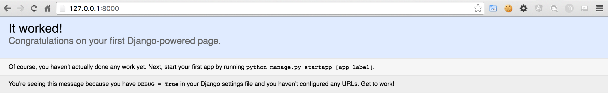
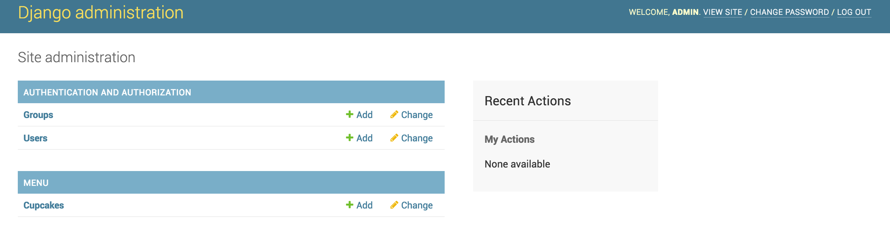
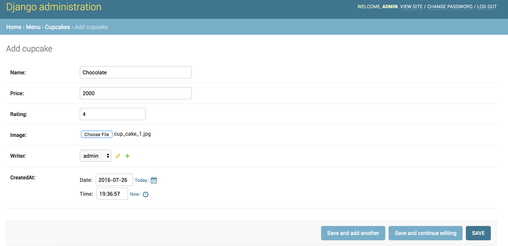

# Demo 데모
## Step 1 [설치하기](http://tutorial.djangogirls.org/ko/deploy/#git-저장소-만들기)
 Make sure that you have installed Python 3.5.x, Git and Editor (atom,sublime text or visual code). 
Before starting our project we setup virtual environment, activate it and then install django using 
 
 ```pip install django```
 
 Once we install django and any other required package, it is good idea to save that in a `requirements.txt` file.
 
 ```pip freeze > requirements.txt```
 
가상환경 사용하고 장고 설치하기 

```pip install django``` 

그리고 `requirements.txt` 이렇게 만들기 

```pip freeze > requirements.txt```

## Step 2 (Start Project/프로젝트 시작하기)
 Start Django project 
 
 ```django-admin startproject djangocupcakeshop```
 
 Django 프로젝트 시작하기 
 
 ```django-admin startproject djangocupcakeshop```

## Step 3 (Change Settings/설정 변경)
After creating the project, we have to change `TIME_ZONE` in `settings.py` file. You can find it under `djangocupcakeshop/djangocupcakeshop/settings.py` folder. It depends on where your site is hosted. For Seoul, we will change it the following.

```TIME_ZONE = "Asia/Seoul"```

To setup the correct configuration for static files (images, css, javascript), add the following line below `STATIC_URL`.

```STATIC_ROOT = os.path.join(BASE_DIR, 'static')```

`settings.py`에서 `TIME_ZONE`있는 줄을 찾으세요. 그리고 이를 해당 시간대로 변경하세요 

```TIME_ZONE = "Asia/Seoul"```

Finally, we are all set for creating our database tables and checking our project in the browser. Run the following two commands in terminal/command prompt.

```python manage.py migrate

   python manage.py runserver```
   
Open the browser and go to the link : [http://127.0.0.1:8000](http://127.0.0.1:8000)



다음으로 정적파일 경로를 추가할 거에요. (정적 파일은 튜토리얼 후반부에서 CSS와 함께 다룰 거에요) 파일의 끝(end)으로 내려가서, `STATIC_URL`항목 바로 아래에 STATIC_ROOT을 추가하세요 

```STATIC_ROOT = os.path.join(BASE_DIR, 'static')```

데이터베이스 설정하기 블로그에 데이터베이스를 생성하기 위해서 콘솔창에서 이 코드를`python manage.py migrate` 실행하세요. 이제 웹 서버를 시작해 웹사이트가 잘 작동하는지 확인해봐요! 

```python manage.py runserver```


## Step 4 (Django App/Model 앱/모델)
> Relevant git branch `model`

a. We create the app name `menu` and add it to `settings.py` file in the section `INSTALLED_APPS`

```python manage.py startapp menu```

a. menu 어플리케이션 제작하기 

```python manage.py startapp menu```

#### Demo starts from here

b. We are going to create a model for our menu app. From here onwards, start following me on and refer to tutorial for references. The required fields for our model class `Cupcake` are `name,ratings,price,image,writer and createdAt`. You also have to install `Pillow` package which is required for `ImageField`. so install it by `pip install Pillow` and then update requirements file by `pip freeze > requirements.txt`

```
class Cupcake(models.Model):
    name = models.CharField(max_length=200)
    price = models.CharField(max_length=20)
    rating = models.FloatField()
    image = models.ImageField(upload_to='images/cakes')
    writer = models.ForeignKey(User)
    createdAt = models.DateTimeField(default=timezone.now)

    def __str__(self):
        return self.name
        
        ```
 c. After creating model, we create actual tables in database by using `python manage.py makemigrations menu` and `python manage.py migrate`. 
 > Note that `makemigrations` command creates the script in `djangocupcakeshop/menu/migrations` folder which should be executed using `migrate command`
 > At this point after `makemigrations` you can test your model by executing `python manage.py test`. We have provided a test case already for your convenience!
 

#### 데모 여기부터 

b. `Cupcake` 글 모델 만들기 속성:
`name,ratings,price,image,writer and createdAt` fields

```
class Cupcake(models.Model):
    name = models.CharField(max_length=200)
    price = models.CharField(max_length=20)
    rating = models.FloatField()
    image = models.ImageField(upload_to='images/cakes')
    writer = models.ForeignKey(User)
    createdAt = models.DateTimeField(default=timezone.now)

    def __str__(self):
        return self.name
        
        ```

c. 데이터베이스에 모델을 위한 테이블 만들기 `python manage.py makemigrations menu` 그리고 `python manage.py migrate` 실행하세요

## Step 5 [Django Admin 관리자](http://tutorial.djangogirls.org/en/django_admin/#django-admin)
> Relevant git branch `admin`

a. Register our model in admin so that we can add cupcakes from admin site. Open `menu/admin.py` file and add the following.

```
from django.contrib import admin
from .models import Cupcake

admin.site.register(Cupcake)
```
b. Now its time to add few cupcakes from the site. But in order to do so, you would need admin account. Create it by executing following command in terminal/command prompt and follow the instructions.

```python manage.py createsuperuser```

Start server again `python manage.py runserver`. Visit [http://127.0.0.1:8000/admin](http://127.0.0.1:8000/admin) to login and add cupcakes!





a. 관리자 페이지에서 만든 모델을 보려면 admin.site.register(Cupcake)로 모델을 등록해야해요.

b. 로그인을 하기 위해서는, 모든 권한을 가지는 슈퍼유저(superuser)를 생성해야해요. 커맨드라인으로 돌아가서 `python manage.py createsuperuser`을 입력하고 엔터를 누르세요. 브라우저로 돌아와서 장고 관리자 페이지에서 슈퍼유저로 로그인한 후 대시보드를 확인하세요

## Step 6 (Django Urls)
	a. 첫 번째 URL을 만들어 봅시다! 우리는 'http://127.0.0.1:8000/'가 홈페이지 주소로 만들어 글 목록이 보이게 만들어 볼 거에요.

## Step 7 (Django 뷰)
	a. Django 뷰 만들기. 뷰는 views.py 파일 안에 있습니다. 우리는 views 를 menu/views.py 파일 안에 추가할 거에요.

## Step 8 [Django 템플릿](http://tutorial.djangogirls.org/ko/template_extending/#템플릿-확장하기)
 	a. Bootstrap 사용하고 menu list 템플릿 만들기
	b. Bootstrap 사용하고 menu detail 템플릿 만들기
	c. 템플릿 확장하기

## Step 9 [템플릿의 동적 데이터](http://tutorial.djangogirls.org/en/dynamic_data_in_templates/#dynamic-data-in-templates)
	a. 쿼리셋
	b. menu 목록 템플릿 보여주기

## Step 10 (프로그램 어플리케이션 확장하기)
	a. menu에 템플릿 링크 만들기 그리고 Rest 상세 페이지에 뷰 추가하기
	b. 다시한번 배포 하기

## Step 11 [배포하기](http://tutorial.djangogirls.org/ko/deploy/#github에서-pythonanywhere로-코드-가져오기)
	a. PythonAnywhere에서 무료 계정인 "초보자(Beginner)"로 회원가입 하세요. GitHub에서 PythonAnywhere로 코드 가져오기
	b. PythonAnywhere에서 가상환경(virtualenv) 생성하기. 콘솔창에서 `virtualenv --python=python3.4 myvenv` 그리고 `pip install -r requirements.txt` 실행하세요.정적 파일 모으기 `python manage.py collectstatic`
	c. PythonAnywhere에서 데이터베이스 생성하기 `python manage.py migrate`
	d. web app으로 DjangoCupcakeshop 배포하기 - 가상환경(virtualenv) 설정하기 그리고 WSGI 파일 설정하기


## Step 12 (Django 폼)
	a. 이제 한 가지만 더 하면 웹사이트가 완성되어요. 바로 식당을 추가하거나 수정하는 멋진 기능을 추가하는 것이죠. 폼과 페이지 링크 만들기
	b. 폼과 링크를 연결하고 저장된 폼에 View 메소드를 추가하기
	c. 폼 보안
	d. 폼 수정하기- 한 가지만 더: 배포하세요

## Step 13 (숙제)
	a. '점수' 목록 배열하기
	b. '가격' 목록 배열하기

## Step 14 (Extended)


