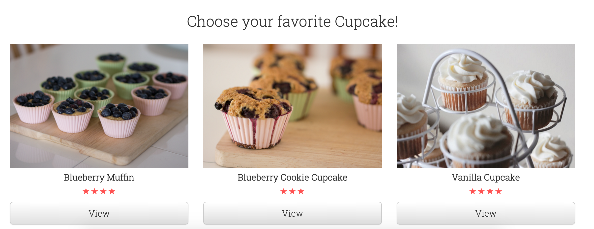

# Demo Part 2
## Step 9 Dynamic data in Templates with ORM [템플릿의 동적 데이터](http://tutorial.djangogirls.org/en/dynamic_data_in_templates/#dynamic-data-in-templates)
>relevant git branch `orm`

a. Get Dynamic data (cupcakes) from database using queryset. Add following code in `menu/views.py` in `cupcake_list` function.

```python
from django.shortcuts import render
from .models import Cupcake

def cupcake_list(request):
    cakes = Cupcake.objects.all().order_by('-createdAt')
    context = {"cakes": cakes}
    return render(request,"menu/list.html",context)
    ```

Above query `Cupcake.objects.all().order_by('-createdAt')` will fetch all the cupcakes from the database in descending order with respect to `createdAt`.

> That code loads the template called menu/list.html and passes it a context. The `context` is a dictionary mapping template variable names to Python objects.

If we visit the home page, we cannot see the data from database in template. Time to go back to our template and display this QuerySet!

b. We will use Django Template Tags to add data from our queryset to template. We will remove the hard-coded cupcakes and replace it with following. 

`list.html`

``` html
<div class="container">
    
    <h2 class="text-center">Choose your favorite Cupcake!</h2>
    <div class="row">
      
      <div class="col-xs-12 col-sm-6 col-md-4 col-lg-4">
        <div class="card">
        <div class="card-img-top">
          <div class="image" style="background-image: url({{ cake.image.url }});"></div>
        </div>
        <div class="card-block">
          <h4 class="card-title text-center">{{ cake.name }}</h4>
          <p class="card-text text-center"><button type="button" class="btn btn-primary btn-lg">
              <span class="glyphicon glyphicon-star" aria-hidden="true"></span> {{ cake.rating }}
          </button></p>
          <a href="#" class="btn btn-default btn-lg btn-block">View</a>
        </div>
        </div>
      </div>
      
    </div>
    
    <h2 class="text-center">No Cupcakes added yet -:(</h2>
    
  </div>

```
Start development server again and visit home page to see the cupcakes from your database appear in template :)




a. 쿼리셋
b. menu 목록 템플릿 보여주기

## Step 10 Extend your Application 프로그램 어플리케이션 확장하기
> Relevant branch `extend-app`

a. Until now we have properly configured the `list.html` template. You can see posts added from admin on homepage. Good job! Now we want user to see more details about a `Cupcake` once they click the View Button.  We will go back to the basics and repeat the steps we did for configuring `list.html` template.

First of all, we will add a new `url` which will point to a single cupcake. Add the following code to `menu/urls.py` file below `url(r'^$',views.cupcake_list,name="cupcake_list"),`

```python
url(r'^cupcake/(?P<pk>\d+)/$',views.cupcake_detail,name="cupcake_detail")
```

This part `^cupcake/(?P<pk>\d+)/$` looks scary, but no worries - You can read explanation about it here [[Eng](http://tutorial.djangogirls.org/en/extend_your_application/#create-a-url-to-a-posts-detail), [Kor](https://djangogirlsseoul.gitbooks.io/tutorial/content/extend_your_application/)].

Then add a function `cupcake_detail` in `menu/views.py` to render the template we created earlier. Any url like `cupcake/1` will be sent to view function `cupcake_detail`. 

```python
from django.shortcuts import render, get_object_or_404

def cupcake_detail(request,pk):
    cake = get_object_or_404(Cupcake,pk=pk)
    context = {"cake": cake}
    print(cake)
    return render(request,"menu/detail.html",context)

```

b. There are two more things we have to do before we can see the cupcake detail page. Firstly, add a link to `list.html` template which can take us to detail page. Replace existing `<a href="#"...` with following code.

```html
<a href="" class="btn btn-default btn-lg btn-block">View</a>

```

The mysterious `` will take us to the view function `cupcake_detail` which in turn will show us the detail page! 

Seondly, we are going to add template tags in `detail.html` for showing the cupcake from database.

```html
<div class="container">
    
    <h2 class="text-center">Choose your favorite Cupcake!</h2>
    <div class="row">
      
      <div class="col-xs-12 col-sm-6 col-md-4 col-lg-4">
        <div class="card">
        <div class="card-img-top">
          <div class="image" style="background-image: url({{ cake.image.url }});"></div>
        </div>
        <div class="card-block">
          <h4 class="card-title text-center">{{ cake.name }}</h4>
          <p class="card-text text-center"><button type="button" class="btn btn-primary btn-lg">
              <span class="glyphicon glyphicon-star" aria-hidden="true"></span> {{ cake.rating }}
          </button></p>
          <a href="" class="btn btn-default btn-lg btn-block">View</a>
        </div>
        </div>
      </div>
      
    </div>
    
    <h2 class="text-center">No Cupcakes added yet -:(</h2>
    
  </div>
```
Start development server again, and click on `view` button in home page to see detail page. Here is one example below 


a. menu에 템플릿 링크 만들기 그리고 menu 상세 페이지에 뷰 추가하기


## Step 11 Deploy your site on PythonAnywhere [배포하기](http://tutorial.djangogirls.org/ko/deploy/#github에서-pythonanywhere로-코드-가져오기)

> Relevant branch `deploy`

Good work, if you have reached this far! Before deploying our site on PythonAnywhere. We have to commit all the changes and push them to `Github`

	a. PythonAnywhere에서 무료 계정인 "초보자(Beginner)"로 회원가입 하세요. GitHub에서 PythonAnywhere로 코드 가져오기
	b. PythonAnywhere에서 가상환경(virtualenv) 생성하기. 콘솔창에서 `virtualenv --python=python3.4 myvenv` 그리고 `pip install -r requirements.txt` 실행하세요.정적 파일 모으기 `python manage.py collectstatic`
	c. PythonAnywhere에서 데이터베이스 생성하기 `python manage.py migrate`
	d. web app으로 DjangoCupcakeshop 배포하기 - 가상환경(virtualenv) 설정하기 그리고 WSGI 파일 설정하기


## Step 12 (Django Forms 폼)
	a. 이제 한 가지만 더 하면 웹사이트가 완성되어요. 바로 식당을 추가하거나 수정하는 멋진 기능을 추가하는 것이죠. 폼과 페이지 링크 만들기
	b. 폼과 링크를 연결하고 저장된 폼에 View 메소드를 추가하기
	c. 폼 보안
	d. 폼 수정하기- 한 가지만 더: 배포하세요

## Step 13 Homework (숙제)
	a. '점수' 목록 배열하기
	b. '가격' 목록 배열하기


