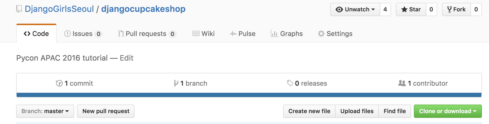
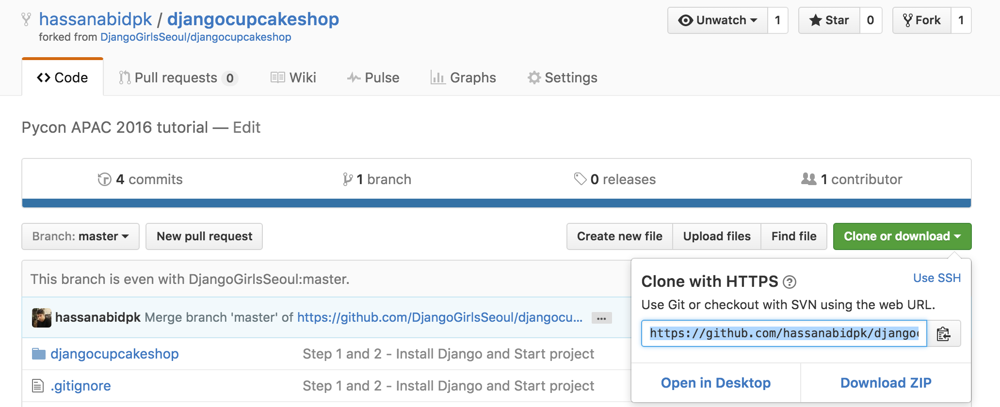

# Getting Started 시작하기

## Fork and clone this repository for Tutorial 이 튜토리얼을 찍고 내 리퍼지토리로 복사하세요.

Press the fork button on the top right at this [link](https://github.com/djangogirlscodecamp/djangocupcakeshop) 오른쪽 위에 있는 Fork 버튼을 누른다



Use git clone to copy code on your computer. git clone 사용하여 



```git clone https://github.com/<user_name>/djangocupcakeshop.git```

  > Note: replace <user_name> with your github username. It should be the forked repository from step 1. 

Open terminal (Mac/Linux) or command prompt (windows) and go to dinewithcode folder 
```cd djangocupcakeshop ```

`cd djangocupcakeshop` 치고 djangocupcakeshop 폴더 안으로 이동

Create a virtual environment by using the command
#### Windows:
```C:\Python35\python -m venv myvenv```
#### Mac:
```python3 -m venv myvenv ``` on Mac and 
####Linux:
```virtualenv --python=python3.4 myvenv```

가상환경을 만든다.아래 command 콘솔에 치면 된다.
#### 윈도우의 경우 
```C:\Python35\python -m venv myvenv``` 
#### 맥의 경우 
```python3 -m venv myvenv ```
리눅스의 경우 : 
```virtualenv --python=python3.4 myvenv```

Activate virtual environment by using 
#### windows
``` myvenv\Scripts\activate ```
#### Mac/Linux
```source myvenv/bin/activate ```

Confirm it by seeing myvenv appears like this on your terminal/command prompt

```(myvenv)... ```

Install django by executing this command 

```pip install -r requirements.txt```

가상환경을 활성화 시킨다. 

#### 윈도우의 경우: 
```myvenv\Scripts\activate ``` 

### 맥이나 리눅스의 경우: 

```source myvenv/bin/activate``` 

치고, 요구되는 사항들을 옆의 명령어를 통해 설치한다. 

```pip install -r requirements.txt```

Make database by executing the following command
```python manage.py migrate```

`python manage.py migrate` 통해 데이터 베이스를 만든다.

Follow step 4(b) from demo section onwards
데모를 4(b) 단계 부터 따라한다.
