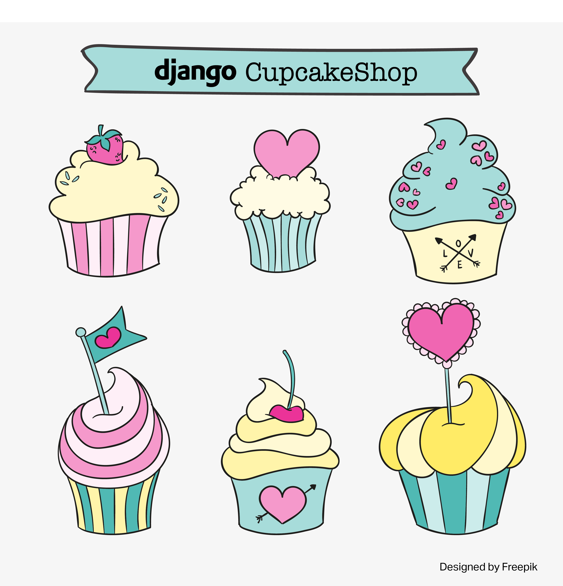

# Django Cupcake shop (PyCon APAC 2016 Tutorial)

   ####### cc. [Designed by Freepik](http://www.freepik.com)

> Creative Commons Attribution-ShareAlike 4.0 International http://creativecommons.org/licenses/by-sa/4.0

## Translation
>This tutorial is translated to Korean by Django Girls Seoul Organizers.

> Translators : [Sujin Lee 이수진](http://sujinlee.me/), [Soeun Lee
> 이소은](https://github.com/mojosoeun)

## Coaches/Helpers

> Django Girls Seoul Coaches & Organizers

Hassan Abid, Jin Park, Soeun Lee, Sujin Lee, Joeun Park, Minseon Kim, Downy Song, John Choi, Jiho Jang

## What will you learn from this tutorial?
This tutorial will walk you through all the steps in creating a cupcake menu site. By the end, you'll be confident enough to make your website!

## Brief Introduction
If you want to get started with Django, there is a great [official Django tutorial](https://docs.djangoproject.com/en/1.9/intro/tutorial01/) you can try. Unfortunately, it is written for people who have some prior web programming experience. But there is an easy version written for beginners with all the installation steps included. You guessed it right! It's the [Django Girls Tutorial](http://tutorial.djangogirls.org/). You might have tried it at home, but were not sure how to start your own project. This tutorial will walk you through all the steps in creating a Cupcake shop menu site *DjangoCupcake Shop*. By the end, you'll be confident enough to make your website! Cupcakes and high fives!

# Detailed description

### Introduction
**Django** is a large and sometimes complex framework for building web applications and sites using the popular programming language, Python. For many beginners, once they complete the Django tutorial, the next step is unknown. They are unsure how to start their own website. The purpose of this tutorial to guide you through all the steps involved in creating a new website project from scratch.For this tutorial, you can fork repository and then clone it to get the starting code. Follow along tutor for live coding.

### Brief Description:

Inspired from [Django Girls](https://www.djangogirls.org) **'Cupcakes and high fives'** expression at end of every email, We will build a cupcake menu website called DjangoCupcake Shop[[Github](https://github.com/DjangoGirlsSeoul/djangocupcakeshop)]. We will also look into how to create a virtual environment and `pip install django` and other packages. What goes inside a model, how to create an ImageField and how to add a model form for allowing users to add data. Finally, we will deploy our site on PythonAnywhere and Azure(if time available) for whole world to see it!

### Prerequisites:

While beginners are welcome for this tutorial, we recommend installing Python, Django and code Editor beforehand. You can follow these links [[English](http://tutorial.djangogirls.org/en/installation/) , [Korean](https://djangogirlsseoul.gitbooks.io/tutorial/content/installation/)] for adetailed guidelines. This tutorial also assumes that you have already tried either Django Girls Tutorial or any other Django tutorial and know the basics of Python.

The primary language will be **English**, however the tutorial itself is available in Korean!  Please bring your computer with battery fully charged!

### Specific Goals for this tutorial (Basic)
- The learners should be able to use a virtual environment correctly before starting any Django project.
- The learners should be able to use an ImageField in model.
- The leaners should be able understand the admin role in Django.
- The learners should able to make base templates and extend other templates from base template.
- The learners should be able to create a model form and add it to the template.
- The learners should be able to use Git/Github basic commands for adding their project on github
- The learners should be able to deploy their site on PythonAnywhere server with debug turned off.
- The learners should be able to write simple tests for their Django site.

### Advance

If you have prior Django or Web experience and want to challenge yourself, then advance tutorial is for you!. It covers various topics which as are follows:
* Django Auth (Login and Signup)
* Django Model Relationships (Comments)
* Django Rest-framework
* Continuous Integration and coverage test (Travis-CI and Coveralls).
* Micrsoft's `Azure` deployment guide.

### Detailed Steps

Follow along with tutor for step by step guide
