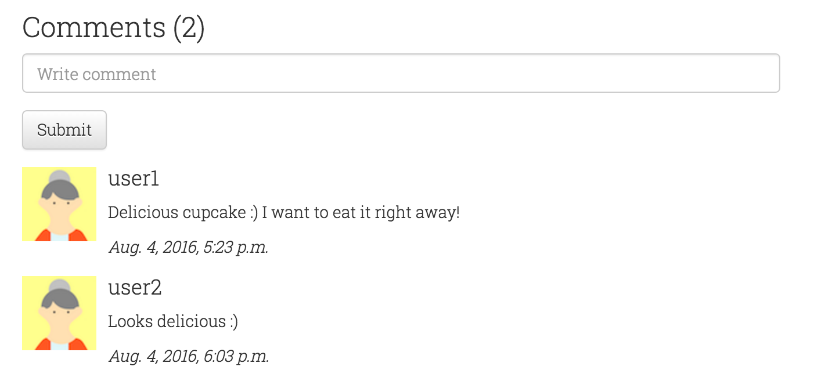
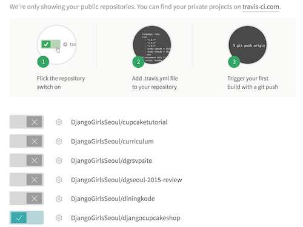
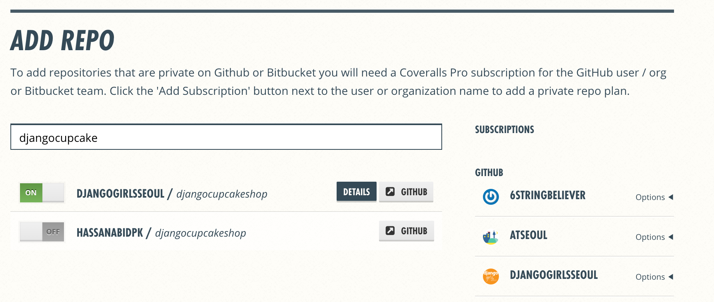
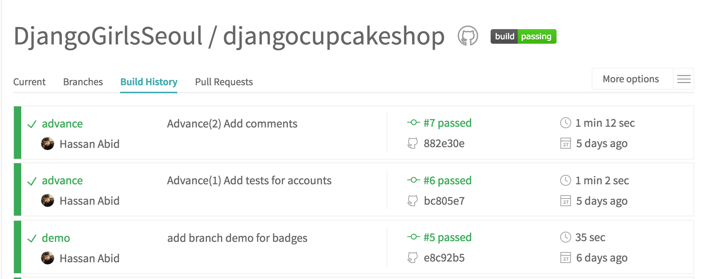
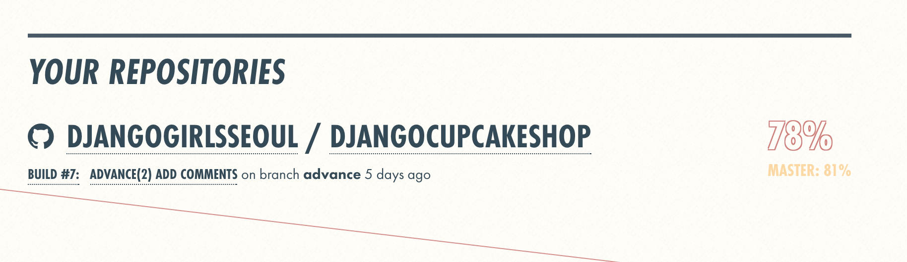

# Advance

## Login and Register
Login and signup are an essential part of websites nowadays. Django comes with a default [user authentication system](https://docs.djangoproject.com/en/1.9/topics/auth/). You can also extend and customize it! We are going to add signup and login page to our website. 

For this purpose we create a new app `accounts`. 

```bash
$ python manage.py startapp accounts
```
and keep all the logic related to login and signup there. Add the app `accounts` in `INSTALLED_APPS` (settings.py)

We will start implementing the login functionality as we have created a superuser already so we can test it right away. 

Add following `url` to point all the auth related links to `accounts.url`

`djangocupcakeshop.urls.py`

```python
url(r'^accounts/', include('accounts.urls', namespace="accounts")),
```

Create a file `urls.py` in `accounts` directory. Add the following code to it.

```python
from django.conf.urls import include, url
from . import views

urlpatterns = [
    url('^', include('django.contrib.auth.urls')),
]

```
This will include the following URL patterns:

```bash
^login/$ [name='login']
^logout/$ [name='logout']
^password_change/$ [name='password_change']
^password_change/done/$ [name='password_change_done']
^password_reset/$ [name='password_reset']
^password_reset/done/$ [name='password_reset_done']
^reset/(?P<uidb64>[0-9A-Za-z_\-]+)/(?P<token>[0-9A-Za-z]{1,13}-[0-9A-Za-z]{1,20})/$ [name='password_reset_confirm']
^reset/done/$ [name='password_reset_complete']

```
For our tutorial, we are going to use `login,logout` and create a `registration` page. 

The default login url should have a template  `registration/login.html`. So we create a new directory `registration` in `accounts` directory. In the `registration` directory create a `login.html` file with the following contents.

```html




  <div class="container">
    <!-- Main component for a primary marketing message or call to action -->
    <div class="jumbotron title text-center" style="height: 150px;">
      <h3 style="color:black;">Welcome back!</h3>
    </div>

  </div> <!-- /container -->

  <div class="container">
    <div class="row">
      <div class="col-xs-12 col-sm-12 col-md-offset-4 col-lg-offset-4 col-md-6 col-lg-6">
        
          <p style="color:red;">Your username and password didn't match. Please try again.</p>
        
        
          
            <p>Your account doesn't have access to this page. To proceed,
              please login with an account that has access.</p>
          
            <p style="color:red;">Please login to see this page.</p>
          
        
        <form class="form-horizontal" method="post" action="">
          
        <div class="form-group">
          <label for="{{ form.username.id_for_label }}" class="col-sm-2 col-md-2 col-lg-2 control-label">Username</label>
          <div class="col-sm-10 col-md-5 col-lg-5">
            <input type="text" class="form-control" id="{{ form.username.id_for_label }}" name="{{ form.username.html_name }}" placeholder="username">
          </div>
        </div>
        <div class="form-group">
          <label for="{{ form.password.id_for_label }}" class="col-sm-2 col-md-2 col-lg-2 control-label">Password</label>
          <div class="col-sm-10 col-md-5 col-lg-5">
            <input type="password" class="form-control" id="{{ form.password.id_for_label }}" name="{{ form.password.html_name }}" placeholder="Password">
          </div>
        </div>
        <input type="hidden" name="next" value="{{ next }}" />
        <div class="form-group">
          <div class="col-sm-offset-2 col-sm-10">
            <button type="submit" class="btn btn-default">Log in</button>
          </div>
        </div>
      </form>
    </div>
    </div>
  </div>


```

Start developement server and visit [http://127.0.0.1/accounts/login](http://127.0.0.1/accounts/login) . After logging in, you will encounter an error, because we haven't setup view and template for profile page. Let's create a `profile.html` page in `registration` directory 

`profile.html`

```html




  <div class="container">
    <div class="jumbotron title text-center" style="height: 150px;">
      <h3 style="color:black;">Hello {{ request.user.username }}!</h3>
    </div>
  </div>

  <div class="container">
    
    <h2 class="text-center">My Cupcakes!</h2>
    <div class="row">
      
      <div class="col-sm-6 col-md-4">
        <div class="thumbnail" style="height:336px;">
          <a href=""></a>
          <div class="caption">
            <h3>{{ cake.name }}</h3>
          </div>
        </div>
      </div>
      
    </div>
    
    <h2 class="text-center">No Cupcakes added yet -:(</h2>
    
  </div>


```

As you can notice from the template, that it contains the cupcakes added by user. We have to add a view function for user profile. Go ahead and add the following code to accounts app's `views.py` file.

```python
from django.shortcuts import render
from django.contrib.auth.decorators import login_required
from menu.models import Cupcake

@login_required
def user_profile(request):
    my_cakes = Cupcake.objects.filter(writer=request.user)
    context = {'cakes':my_cakes}
    return render(request,"registration/profile.html",context)

```

We haven't added login and signup links in our `base.html` template yet. After adding login and singup links, our `base.html` will look like following. 

```html


<!DOCTYPE html>
<html lang="en">
<head>
  <meta charset="utf-8">
  <meta http-equiv="X-UA-Compatible" content="IE=edge">
  <meta name="viewport" content="width=device-width, initial-scale=1">
	<title>Django Cupcake Shop</title>

<link rel="stylesheet" href="https://maxcdn.bootstrapcdn.com/bootstrap/3.3.6/css/bootstrap.min.css">
<!-- Optional theme -->
<link rel="stylesheet" href="https://maxcdn.bootstrapcdn.com/bootstrap/3.3.6/css/bootstrap-theme.min.css">
<link rel="stylesheet" href="">
</head>
<body>
  <!-- Fixed navbar -->
  <nav class="navbar navbar-default navbar-fixed-top">
    <div class="container">
      <div class="navbar-header">
        <button type="button" class="navbar-toggle collapsed" data-toggle="collapse" data-target="#navbar" aria-expanded="false" aria-controls="navbar">
          <span class="sr-only">Toggle navigation</span>
          <span class="icon-bar"></span>
          <span class="icon-bar"></span>
          <span class="icon-bar"></span>
        </button>
        <a class="navbar-brand" href="/">Django Cupcake Shop</a>
      </div>
      <div id="navbar" class="navbar-collapse collapse">
        <ul class="nav navbar-nav navbar-right">
          
          <li><p class="navbar-text">Welcome <a href="/accounts/profile">{{ user.username }}</a></p></li>
           <li><a href=""><span class="glyphicon glyphicon-plus"></span></a></li>
           <a href="" class="btn btn-danger navbar-btn">Logout</a>
           
           <a href="}" class="btn btn-primary navbar-btn">Register</a>
           <a href="" class="btn btn-default navbar-btn">Sign in</a>
           
          <li class="dropdown">
            <a href="#" class="dropdown-toggle" data-toggle="dropdown" role="button" aria-haspopup="true" aria-expanded="false">Sort by <span class="caret"></span></a>
            <ul class="dropdown-menu">
              <li><a href="#">Highest</a></li>
              <li><a href="#">Lowest</a></li>
            </ul>
          </li>
        </ul>
      </div><!--/.nav-collapse -->
    </div>
  </nav>

    
    

  <footer class="footer">
      <div class="container">
        <p class="text-muted">Pycon 2016 Tutorial.</p>
      </div>
    </footer>
  <script src="https://ajax.googleapis.com/ajax/libs/jquery/1.11.3/jquery.min.js"></script>
  <script src="https://maxcdn.bootstrapcdn.com/bootstrap/3.3.6/js/bootstrap.min.js" ></script>
  <script>
  $(function () {
  $('[data-toggle="popover"]').popover()
  })
  </script>
</body>
</html>


```

Start development server and test login. Next step would be to add a register page. For this purpose we have to do a little more than what we did for login. Firstly of all, let's create a register template in the same folder with `profile.html` and `login.html`.

`register.html`

```html




  <div class="container">
    <!-- Main component for a primary marketing message or call to action -->
    <div class="jumbotron title text-center" style="height: 150px;">
      <h3 style="color:black;">Cupcake and High Fives!</h3>
    </div>

  </div> <!-- /container -->

  <div class="container">
    <div class="row">
      <div class="col-xs-12 col-sm-12 col-md-offset-3 col-lg-offset-3 col-md-6 col-lg-6">
        
          <p style="color:red;">Try again.</p>
        
        <form class="form-horizontal" method="post" action="">
          
        <div class="form-group">
          <label for="{{ form.username.id_for_label }}" class="col-sm-4 col-md-4 col-lg-4 control-label">Username</label>
          <div class="col-sm-10 col-md-5 col-lg-5">
            <input type="text" class="form-control" id="{{ form.username.id_for_label }}" name="{{ form.username.html_name }}" placeholder="username">
              {{ form.username.errors }}
          </div>
        </div>
        <div class="form-group">
          <label for="{{ form.password1.id_for_label }}" class="col-sm-4 col-md-4 col-lg-4 control-label">Password</label>
          <div class="col-sm-10 col-md-5 col-lg-5">
            <input type="password" class="form-control" id="{{ form.password1.id_for_label }}" name="{{ form.password1.html_name }}" placeholder="Password">
              {{ form.password1.errors }}
          </div>
        </div>
        <div class="form-group">
          <label for="{{ form.password2.id_for_label }}" class="col-sm-2 col-md-4 col-lg-4 control-label">Confirm Password</label>
          <div class="col-sm-10 col-md-5 col-lg-5">
            <input type="password" class="form-control" id="{{ form.password2.id_for_label }}" name="{{ form.password2.html_name }}" placeholder="Password">
              {{ form.password2.errors }}
          </div>
        </div>
        <input type="hidden" name="next" value="{{ next }}" />
        <div class="form-group">
          <div class="col-md-offset-4 col-lg-offset-4 col-sm-offset-2 col-sm-10">
            <button type="submit" class="btn btn-default">Register</button>
          </div>
        </div>
      </form>
    </div>
    </div>
  </div>



```

Add link to register page in `base.html` template

```html
<a href="" class="btn btn-primary navbar-btn">Register</a>
```

Secondly, add a view function `register` to handle register get/post request. 

`accounts/views.py`
Add the following import lines 

```python
from django.http import HttpResponseRedirect
from django.contrib.auth.forms import UserCreationForm
from django.contrib.auth import authenticate,login
```

followed by 

```python
def register(request):
    if request.user.is_authenticated():
        return HttpResponseRedirect('/accounts/profile')

    if request.method == 'POST':
        form = UserCreationForm(request.POST)
        if form.is_valid():
            new_user = form.save()
            print(new_user.username)
            username = request.POST['username']
            password = request.POST['password1']
            user = authenticate(username=username, password=password)
            if user is not None:
                login(request,user)
                return HttpResponseRedirect('/accounts/profile')
    else:
        form = UserCreationForm()
    return render(request, 'registration/register.html', { 'form': form })

```

> Django provides a default `UserCreationForm` which only includes username and password. If you want to add email, first and last name as required paramaters, then you should created a custom form. 

Start development server and test login and register functions.

You might observe that `logout` link takes us to admin logout link. Let's override the default and take user to home page after logging out.

Add following code to `accounts/urls.py`

```python
url('^logout/$',views.logout_view,name="logout"),
```

and corresponding view function to `accounts/views.py`

```python
from django.contrib.auth import logout

def logout_view(request):
    logout(request)
    return HttpResponseRedirect('/')
```

Start development server and test logout feature.

Under ideal circumstances everything works! But we are still going to write tests for our login and register page :) 

`tests.py`

```python

from django.test import TestCase, Client
from django.contrib.auth.models import User

class LoginAndLogout(TestCase):
    def setUp(self):
        self.client = Client()
        u = User.objects.create_user('test_user', 'test@example.com', 'password1')
        u.save()

    def test_login_post(self):
        response = self.client.post("/accounts/login/", {"username": "test_user" ,"password": "password1", "next": "/"}, follow=True)
        self.assertRedirects(response, '/')
        self.assertContains(response, "test_user")

    def test_login_fail(self):
        response = self.client.post("/accounts/login/", {"username": "test_user1" ,"password": "password1", "next": "/"})
        self.assertContains(response, "Your username and password didn't match. Please try again.")

    def test_login_then_logout(self):
        login_response = self.client.post("/accounts/login/", {"username": "test_user" ,"password": "password1", "next": "/"}, follow=True)
        self.assertRedirects(login_response, '/')
        self.assertContains(login_response, "test_user")
        logout_response = self.client.get('/accounts/logout/', follow=True)
        self.assertRedirects(logout_response, '/')
        self.assertNotContains(logout_response, "test_user")

class Register(TestCase):
    def setUp(self):
        self.client = Client()

    def test_register_post(self):
        response = self.client.post("/accounts/register/", {"username": "test_user" ,"password1": "password1",  "password2": "password1"}, follow=True)
        self.assertContains(response, "test_user")
        self.assertEqual(User.objects.get(username="test_user").username, "test_user")

```

You can check tests locally by executing 

```bash
$ python manage.py test accounts
```
##Comments 

If you are wondering how delicious or awesome our Cupcake is ? We have to allow registereted users to express about it via comments. 

#### Create Comment model
A simple comment would have an associated user and cupcake. We are also going to moderate comments and let admin approve it :)

Create a comment model class in `menu/models.py` file.

```python
class Comment(models.Model):
    post = models.ForeignKey(Cupcake, related_name='comments')
    writer = models.ForeignKey(User)
    text = models.TextField()
    created_date = models.DateTimeField(default=timezone.now)
    approved_comment = models.BooleanField(default=False)

    def approve(self):
        self.approved_comment = True
        self.save()

    def __str__(self):
        return self.text

```

For creating the tables in database, execute following two commands. 

```bash
$ python manage.py makemigrations menu

$ $ python manage.py migrate menu
```

#### Register Comment model in Admin

Open `menu/admin.py` and import Comment model class

```python

from .models import Cupcake, Comment
```

and register the comment model by adding the following line.

```python
admin.site.register(Comment)


```

#### Let users write comments

Let's add a form for users to write comments. We have created a Comment model already. Now we are going to create a CommentForm. open `forms.py` and add following code.

> import Comment 

```python

class CommentForm(forms.ModelForm):

    class Meta:
        model = Comment
        fields = ('text',)
```

Add following to `menu/templates/menu/detail.html` just above the `endblock`.

```html

  <div class="row">
      <div class="col-xs-12 col-sm-6 col-md-7 col-lg-7 col-md-offset-3 col-lg-offset-2">
        <h3>Comments ({{ cake.comments.count }})</h3>
        <p></p>
        
        <form method="POST">
          <!-- {{ form.as_p }} -->
          <div class="form-group">
            <input type="text" name="{{ form.text.html_name }}" class="form-control" placeholder="Write comment">
          </div>
          <button type="submit" class="btn btn-default">Submit</button>
        </form>
        
          <p><a href="">Login</a> to post comment</p>
        

        
          
          <div class="media">
            <div class="media-left">
              <a href="#">
                
              </a>
            </div>
            <div class="media-body">
              <h4 class="media-heading">{{ comment.writer }}</h4>
              <p>{{ comment.text|linebreaks }}</p>
              <i>{{ comment.created_date }}</i>
            </div>
          </div>
          
        
          <p>No comments here yet :(</p>
        
      </div>
    </div>
    
    <h2 class="text-center">No Cupcake found :(</h2>
    
  </div>

```

Modify the view function `cupcake_detail` in `menu/views.py` to include the CommentForm. After modifying your code should like the following.

```python
from .forms import CommentForm


def cupcake_detail(request,pk):
    cake = get_object_or_404(Cupcake,pk=pk)
    if request.method == "POST":
        form = CommentForm(request.POST)
        if form.is_valid():
            comment = form.save(commit=False)
            comment.post = cake
            comment.writer = request.user
            comment.approved_comment = True
            comment.save()
            return redirect('menu.views.cupcake_detail', pk=cake.pk)
    else:
        form = CommentForm()
    context = {"cake": cake, "form":form}
    return render(request,"menu/detail.html",context)

```

>For demo purposes we are marking all comments as approved.

Start development server, view any cupcake and try the comment feature :) 



> Tip : After you deploy your site on PythonAnywhere or Azure again with Comment feature. You have to execute migrate command!

## Change database to mySQL

## Custom Admin 

## Travis CI and Coveralls (If time available)

Running tests before every commit and merge can be little tedious. 
> Thankfully, Continuous Integration can save the day. Continuous Integration, often abbreviated to just CI, is the process of automatically building and running tests whenever a change is committed.

We are going to use Travis-CI which is free for open-source projects. Signup for free account on https://travis-ci.org using your Github account. Sync your github repos and enable TRAVIS-CI for project. 



Create a file `.travis.yml` in project root directory. Before adding any contents to file. let's complete the signup process for https://coveralls.io. Once you signedup successfully, you can add Github repo.

>Coveralls is a web service to help you track your code coverage over time, and ensure that all your new code is fully covered.



Add following contents to your `.travis.yml` file.

```bash
language: python
python:
  - '3.5'
branches:
  only:
    - 'advance'
    - 'rest-api'
install:
  - pip install -r requirements.txt
  - pip install coveralls
script:
  - python manage.py test
  - coverage run --source=djangocupcakeshop,menu,accounts manage.py test
notifications:
  email: false
after_success:
  coveralls

```

Make sure to add/change `branches` field. In our case, we are adding advance and rest-api branches only.

Let's add nice badges for showing status of build and coverage in our README. Add markup from Travis and Coveralls to your project's RADME.md. Here is one sample

[](https://travis-ci.org/DjangoGirlsSeoul/djangocupcakeshop)
[](https://coveralls.io/github/DjangoGirlsSeoul/djangocupcakeshop?branch=advance)

Now commit your changes and push to Github. It will automatically initiate a travis-cui build and coverage test. You can find similar reports as below




