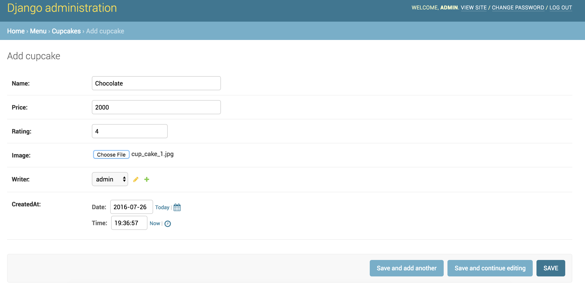
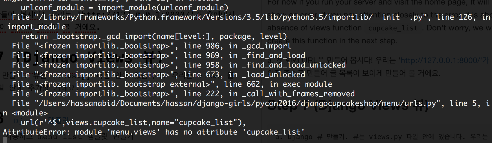
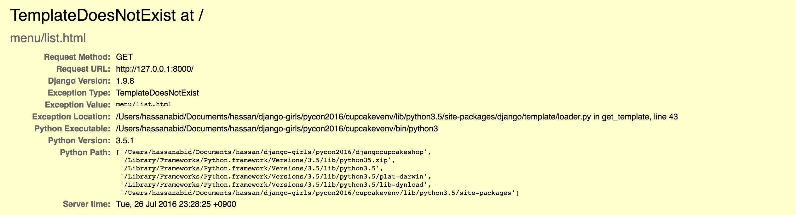

# Demo Part 1 데모
## Step 1 Installation 설치하기

 Make sure that you have installed Python 3.5.x, Git and Editor (atom,sublime text or visual code). 
Before starting our project we setup virtual environment, activate it and then install django using 
 
 ```bash 
 $ pip install django
 ```
 
 Once we install django and any other required package, it is good idea to save that in a `requirements.txt` file.
 
 ```bash
 $ pip freeze > requirements.txt
 ```
 
가상환경 사용하고 장고 설치하기 

```bash
$ pip install django
``` 

그리고 `requirements.txt` 이렇게 만들기 

```bash
$ pip freeze > requirements.txt
```

## Step 2 (Start Project/프로젝트 시작하기)
 Start Django project 
 
 ```bash
 $ django-admin startproject djangocupcakeshop
 ```
 
 Django 프로젝트 시작하기 
 
 ```bash
 $ django-admin startproject djangocupcakeshop
 ```

## Step 3 (Change Settings/설정 변경)
After creating the project, we have to change `TIME_ZONE` in `settings.py` file. You can find it under `djangocupcakeshop/djangocupcakeshop/settings.py` folder. It depends on where your site is hosted. For Seoul, we will change it the following.

```python 
TIME_ZONE = "Asia/Seoul"
```

To setup the correct configuration for static and media files (images, css, javascript), add the following lines below `STATIC_URL`.

```python
STATIC_ROOT = os.path.join(BASE_DIR, 'static')
MEDIA_ROOT = os.path.join(BASE_DIR, 'media')
MEDIA_URL = '/media/'
```

>MEDIA_ROOT and MEDIA_URL setup the path for uploaded images and files.


`settings.py`에서 `TIME_ZONE`있는 줄을 찾으세요. 그리고 이를 해당 시간대로 변경하세요 

```python 
TIME_ZONE = "Asia/Seoul"
```

We are all set for creating our database tables and checking our project in the browser. Run the following two commands in terminal/command prompt.

``` bash
$ python manage.py migrate

$ python manage.py runserver
```
   
Open the browser and go to the link : [http://127.0.0.1:8000](http://127.0.0.1:8000)


다음으로 정적파일 경로를 추가할 거에요. (정적 파일은 튜토리얼 후반부에서 CSS와 함께 다룰 거에요) 파일의 끝(end)으로 내려가서, `STATIC_URL`항목 바로 아래에 STATIC_ROOT을 추가하세요 

```python
STATIC_ROOT = os.path.join(BASE_DIR, 'static')
```

데이터베이스 설정하기 블로그에 데이터베이스를 생성하기 위해서 콘솔창에서 이 코드를`python manage.py migrate` 실행하세요. 이제 웹 서버를 시작해 웹사이트가 잘 작동하는지 확인해봐요! 

```bash
$ python manage.py runserver
```


## Step 4 (Django App/Model 앱/모델)
> Relevant git branch `model`

a. We create the app name `menu` and add it to `settings.py` file in the section `INSTALLED_APPS`

```bash 
$ manage.py startapp menu
```

`settings.py`

```python
INSTALLED_APPS = (
    'django.contrib.admin',
    'django.contrib.auth',
    'django.contrib.contenttypes',
    'django.contrib.sessions',
    'django.contrib.messages',
    'django.contrib.staticfiles',
    'menu',
)

```

a. menu 어플리케이션 제작하기 

``` bash 
$ python manage.py startapp menu
```

```python
INSTALLED_APPS = (
    'django.contrib.admin',
    'django.contrib.auth',
    'django.contrib.contenttypes',
    'django.contrib.sessions',
    'django.contrib.messages',
    'django.contrib.staticfiles',
    'menu',
)

```
#### Demo starts from here

b. We are going to create a model for our menu app. From here onwards, start following me on and refer to tutorial for references. The required fields for our model class `Cupcake` are `name,rating,price,image,writer and createdAt`. You also have to install `Pillow` package which is required for `ImageField`. so install it by executing 

```bash 
(myvenv) $ pip install Pillow
```
and then update requirements file by 

```bash
(myvenv) $ pip freeze > requirements.txt
```

>If there is an error in Windows installation while installing Pillow. Use `pip install Pillow==3.0.0`

The import part will go first 

```python

from django.contrib.auth.models import User
from django.utils import timezone

```

followed by model Class

```python

class Cupcake(models.Model):
    name = models.CharField(max_length=200)
    price = models.CharField(max_length=20)
    rating = models.FloatField()
    image = models.ImageField(upload_to='images/cakes')
    writer = models.ForeignKey(User)
    createdAt = models.DateTimeField(default=timezone.now)

    def __str__(self):
        return self.name
```

 c. After creating model, we create actual tables in database by  executing following commands 
 
 ```bash
 
 $ python manage.py makemigrations menu
 $ python manage.py migrate
 
 ``` 
 
 > By running makemigrations, you’re telling Django that you’ve made some changes to your models (in this case, you’ve made new ones) and that you’d like the changes to be stored as a migration.
 > At this point after `makemigrations` you can test your model by executing `python manage.py test`. We have provided a test case already for your convenience!
 > In Summary `makemigrations` command make migrations for changes in model and `migrate` actually applies those changes in database

#### 데모 여기부터 

b. `Cupcake` 글 모델 만들기 속성:
`name,rating,price,image,writer and createdAt` fields

```python

class Cupcake(models.Model):
    name = models.CharField(max_length=200)
    price = models.CharField(max_length=20)
    rating = models.FloatField()
    image = models.ImageField(upload_to='images/cakes')
    writer = models.ForeignKey(User)
    createdAt = models.DateTimeField(default=timezone.now)

    def __str__(self):
        return self.name
        
```

c. 데이터베이스에 모델을 위한 테이블 만들기 `python manage.py makemigrations menu` 그리고 `python manage.py migrate` 실행하세요

## Step 5 Django Admin 관리자
> Relevant git branch `admin`

a. Register our model in admin so that we can add cupcakes from admin site. Open `menu/admin.py` file and add the following.

```python
from django.contrib import admin
from .models import Cupcake

admin.site.register(Cupcake)
```
b. Now its time to add few cupcakes from the site. But in order to do so, you would need admin account. Create it by executing following command in terminal/command prompt and follow the instructions.

```bash
python manage.py createsuperuser
```

Start developement server again `python manage.py runserver`. Visit [http://127.0.0.1:8000/admin](http://127.0.0.1:8000/admin) to login and add cupcakes!




a. 관리자 페이지에서 만든 모델을 보려면 admin.site.register(Cupcake)로 모델을 등록해야해요.

b. 로그인을 하기 위해서는, 모든 권한을 가지는 슈퍼유저(superuser)를 생성해야해요. 커맨드라인으로 돌아가서 `python manage.py createsuperuser`을 입력하고 엔터를 누르세요. 브라우저로 돌아와서 장고 관리자 페이지에서 슈퍼유저로 로그인한 후 대시보드를 확인하세요

## Step 6 (Django Urls)
> Relevant git branch `django-urls`

a. We have to point a url towards our home page. Firstly, we will point the home page URL to our menu app. Add following to `djangocupcakeshop/urls.py`.

```python 
urlpatterns = [
    url(r'^admin/', include(admin.site.urls)),
    url(r'', include('menu.urls')),
]

```


b. Secondly, we will point URL to corresponding `view` function in our menu app. Create a file in `menu` directory and name it `urls.py`. Add following code

```python
from django.conf.urls import url
from . import views

urlpatterns = [
    url(r'^$',views.cupcake_list,name="cupcake_list"),
]
```
For now if you run your server and visit the home page, It will show an error. If you pay attention to the error, it is about absence of views function `cupcake_list`. Don't worry, we will create this function in the next step.



a. 첫 번째 URL을 만들어 봅시다! 우리는 'http://127.0.0.1:8000/'가 홈페이지 주소로 만들어 글 목록이 보이게 만들어 볼 거에요.

## Step 7 (Django Views 뷰)
In Django, web pages and other content are delivered by views. Each view is represented by a simple Python function. Django will choose a view by examining the URL that’s requested. We have already added `url` for home page in previous step. We are going to add our first view function `cupcakes_list` in `menu/views.py` file.

```python
from django.shortcuts import render
from . import models

def cupcake_list(request):
    return render(request,"menu/list.html",{})
```

Start your server and visit the home page [http://127.0.0.1:8000](http://127.0.0.1:8000) Oops! You will come across following error!. Let's fix this in next step.



 Django 뷰 만들기. 뷰는 views.py 파일 안에 있습니다. 우리는 views 를 menu/views.py 파일 안에 추가할 거에요.

## Step 8 (Django Templates 템플릿)

a. If you look at the error in previous step, you will notice that is complaining about missing template `menu/list.html`. Django template is an html page where you show your data to user which was stored in database. First, create a directory called templates in your menu directory. Django will look for templates in there.
Within the templates directory you have just created, create another directory called menu, and within that create a file called list.html. In other words, your template should be at menu/templates/menu/list.html. We will use bootstrap for creating html page. You can find some example templates [here](http://getbootstrap.com/getting-started/). To customize our template we created a `style.css` file and added few nice images! You can find free cupcake images from [here](https://www.pexels.com/search/cupcake/). For adding static files, create a folder `static` in menu directory. Then create a menu folder. In menu folder, create two folders to hold our css and image files. So your directory sturcture for css will be `menu/static/menu/css` and images `menu/static/menu/images`

`list.html`

```html

<!DOCTYPE html>
<html lang="en">
<head>
  <meta charset="utf-8">
  <meta http-equiv="X-UA-Compatible" content="IE=edge">
  <meta name="viewport" content="width=device-width, initial-scale=1">
	<title>Django Cupcake Shop</title>

<link rel="stylesheet" href="https://maxcdn.bootstrapcdn.com/bootstrap/3.3.6/css/bootstrap.min.css">
<!-- Optional theme -->
<link rel="stylesheet" href="https://maxcdn.bootstrapcdn.com/bootstrap/3.3.6/css/bootstrap-theme.min.css">
<link rel="stylesheet" href="">
</head>
<body>
  <!-- Fixed navbar -->
  <nav class="navbar navbar-default navbar-fixed-top">
    <div class="container">
      <div class="navbar-header">
        <button type="button" class="navbar-toggle collapsed" data-toggle="collapse" data-target="#navbar" aria-expanded="false" aria-controls="navbar">
          <span class="sr-only">Toggle navigation</span>
          <span class="icon-bar"></span>
          <span class="icon-bar"></span>
          <span class="icon-bar"></span>
        </button>
        <a class="navbar-brand" href="/">Django Cupcake Shop</a>
      </div>
      <div id="navbar" class="navbar-collapse collapse">
        <ul class="nav navbar-nav navbar-right">
          <li class="dropdown">
            <a href="#" class="dropdown-toggle" data-toggle="dropdown" role="button" aria-haspopup="true" aria-expanded="false">Sort by <span class="caret"></span></a>
            <ul class="dropdown-menu">
              <li><a href="#">Highest</a></li>
              <li><a href="#">Lowest</a></li>
            </ul>
          </li>
        </ul>
      </div><!--/.nav-collapse -->
    </div>
  </nav>


  <div class="container" >

    <!-- Main component for a primary marketing message or call to action -->
    <div class="jumbotron title text-center" style="background-image: url();">
      <h1 class="title">Cupcakes and High Fives!</h1>
      <p>Django Girls Seoul welcomes you!</p>
      <p>Lets build an awesome Django site together</p>
      <p>
        <a class="btn btn-lg btn-primary" href="https://github.com/DjangoGirlsSeoul/djangocupcakeshop" role="button">Source Code &raquo;</a>
      </p>
    </div>

  </div> <!-- /container -->

  <div class="container">
    <h2 class="text-center">Choose your favorite Cupcake!</h2>
    <div class="row">
      <div class="col-xs-12 col-sm-6 col-md-4 col-lg-4">
        <div class="card">
        <div class="card-img-top">
          <div class="image" style="background-image: url();"></div>
        </div>
        <div class="card-block">
          <h4 class="card-title text-center">Chocolate Cupcake</h4>
            <p class="card-text text-center">
              <span class="glyphicon glyphicon-star" aria-hidden="true"></span>
              <span class="glyphicon glyphicon-star" aria-hidden="true"></span>
              <span class="glyphicon glyphicon-star" aria-hidden="true"></span>
              <span class="glyphicon glyphicon-star" aria-hidden="true"></span>
              <span class="glyphicon glyphicon-star" aria-hidden="true"></span>
            </p>
          <a href="#" class="btn btn-default btn-lg btn-block">View</a>
        </div>
        </div>
      </div>
      <div class="col-xs-12 col-sm-6 col-md-4 col-lg-4">
        <div class="card">
          <div class="card-img-top">
          <div class="image" style="background-image: url();"></div>
          </div>
        <div class="card-block">
          <h4 class="card-title text-center">Vanilla Cupcake</h4>
          <p class="card-text text-center">
            <span class="glyphicon glyphicon-star" aria-hidden="true"></span>
            <span class="glyphicon glyphicon-star" aria-hidden="true"></span>
            <span class="glyphicon glyphicon-star" aria-hidden="true"></span>
            <span class="glyphicon glyphicon-star" aria-hidden="true"></span>
          </p>
          <a href="#" class="btn btn-default btn-lg btn-block">View</a>
        </div>
        </div>
      </div>
      <div class="col-xs-12 col-sm-6 col-md-4 col-lg-4">
        <div class="card">
          <div class="card-img-top">
          <div class="image" style="background-image: url();"></div>
          </div>
        <div class="card-block">
          <h4 class="card-title text-center">Blueberry Cookie Cupcake</h4>
          <p class="card-text text-center">
            <span class="glyphicon glyphicon-star" aria-hidden="true"></span>
            <span class="glyphicon glyphicon-star" aria-hidden="true"></span>
            <span class="glyphicon glyphicon-star" aria-hidden="true"></span>
          </p>
          <a href="#" class="btn btn-default btn-lg btn-block">View</a>
        </div>
        </div>
      </div>
    </div>
  </div>

  <footer class="footer">
      <div class="container">
        <p class="text-muted">Pycon 2016 Tutorial.</p>
      </div>
    </footer>
  <script src="https://ajax.googleapis.com/ajax/libs/jquery/1.11.3/jquery.min.js"></script>
  <script src="https://maxcdn.bootstrapcdn.com/bootstrap/3.3.6/js/bootstrap.min.js" ></script>

</body>
</html>

```
We also need a css file for minor adjustments in the template. Create  file `style.css` in `menu/static/menu/css` folder. Add following contents to css file 
`style.css`

```css
 @import url(http://fonts.googleapis.com/css?family=Raleway:400,800|Roboto+Slab:300);


body {
  font-family: "Roboto Slab","Helvetica", "Arial", sans-serif;;
  padding-top: 70px;
}

.card {
  margin: 2rem auto;
}
.image {
  width: 100%;
  height: 250px;
  padding-bottom: 50%;
  transition: 0.1s linear;
  background-image: url(http://www.freeallimages.com/wp-content/uploads/2014/09/space-cat-wallpaper-5.jpg);
  background-size: cover;
  background-position: center center;
}

.card-title {
  margin-bottom: 1rem;
  font-weight: 900;
}

.jumbotron {
  height: 450px;
}

.title {
  color: white !important;

}

.footer {
  position: relative;
  bottom: 0;
  width: 100%;
  margin-top: 150px;
  text-align: center;
  /* Set the fixed height of the footer here */
  height: 60px;
  background-color: #f5f5f5;
}
.footer > .container {
  padding-right: 15px;
  padding-left: 15px;
}
.text-muted {
  margin-top: 20px;
}

.glyphicon
{
  color:#FF5252;
}

/* navbar */
.navbar-default {
    border-color: #FF5252;
}

a {
  color: #FF5252;
}

 
```
In `menu/static/images` folder, add three cupcakes images and make sure that names are same as the ones in `list.html` file.

b. We have to create a detail page for our `cupcake` where we can show more information such as price and user who uploaded it. Let's create a `detail.html` in the same folder as `list.html`

```html 

<!DOCTYPE html>
<html lang="en">
<head>
  <meta charset="utf-8">
  <meta http-equiv="X-UA-Compatible" content="IE=edge">
  <meta name="viewport" content="width=device-width, initial-scale=1">
	<title>Django Cupcake Shop</title>

<link rel="stylesheet" href="https://maxcdn.bootstrapcdn.com/bootstrap/3.3.6/css/bootstrap.min.css">
<!-- Optional theme -->
<link rel="stylesheet" href="https://maxcdn.bootstrapcdn.com/bootstrap/3.3.6/css/bootstrap-theme.min.css">
<link rel="stylesheet" href="">
</head>
<body>
  <!-- Fixed navbar -->
  <nav class="navbar navbar-default navbar-fixed-top">
    <div class="container">
      <div class="navbar-header">
        <button type="button" class="navbar-toggle collapsed" data-toggle="collapse" data-target="#navbar" aria-expanded="false" aria-controls="navbar">
          <span class="sr-only">Toggle navigation</span>
          <span class="icon-bar"></span>
          <span class="icon-bar"></span>
          <span class="icon-bar"></span>
        </button>
        <a class="navbar-brand" href="/">Django Cupcake Shop</a>
      </div>
      <div id="navbar" class="navbar-collapse collapse">
        <ul class="nav navbar-nav navbar-right">
          <li class="dropdown">
            <a href="#" class="dropdown-toggle" data-toggle="dropdown" role="button" aria-haspopup="true" aria-expanded="false">Sort by <span class="caret"></span></a>
            <ul class="dropdown-menu">
              <li><a href="#">Highest</a></li>
              <li><a href="#">Lowest</a></li>
            </ul>
          </li>
        </ul>
      </div><!--/.nav-collapse -->
    </div>
  </nav>

  <div class="col-xs-12 col-sm-6 col-md-3 col-lg-3">
          <div class="card">
        <ul class="list-group">
          <li class="list-group-item"><span class="glyphicon glyphicon-tag"></span>  <strong>Chocolate Cupcake</strong></li>
          <li class="list-group-item"><span class="glyphicon glyphicon-usd"></span> 3.00</li>
          <li class="list-group-item"><span class="glyphicon glyphicon-pencil"></span> John</li>
          <li class="list-group-item"><span class="glyphicon glyphicon-calendar"></span> 3rd June, 2015</li>
          <li class="list-group-item">
            <span class="glyphicon glyphicon-star"></span>
            <span class="glyphicon glyphicon-star"></span>
            <span class="glyphicon glyphicon-star"></span>
            <span class="glyphicon glyphicon-star"></span>
            <span class="glyphicon glyphicon-star"></span>
          </li>
          <li class="list-group-item">
            <button type="button" class="btn btn-primary" data-toggle="modal" data-target="#myModal">
              Order
            </button>
             </li>
        </ul>
      </div>
    </div>
    </div>
  </div>
  <!-- Modal -->
<div class="modal fade" id="myModal" tabindex="-1" role="dialog" aria-labelledby="myModalLabel">
  <div class="modal-dialog" role="document">
    <div class="modal-content">
      <div class="modal-header">
        <button type="button" class="close" data-dismiss="modal" aria-label="Close"><span aria-hidden="true">&times;</span></button>
        <h4 class="modal-title" id="myModalLabel">Chocolate Cupcake</h4>
      </div>
      <div class="modal-body">
        Complete this website to get your Cupcake!
      </div>
      <div class="modal-footer">
        <button type="button" class="btn btn-default" data-dismiss="modal">Close</button>
      </div>
    </div>
  </div>
</div>
  <footer class="footer">
      <div class="container">
        <p class="text-muted">Pycon 2016 Tutorial.</p>
      </div>
    </footer>
  <script src="https://ajax.googleapis.com/ajax/libs/jquery/1.11.3/jquery.min.js"></script>
  <script src="https://maxcdn.bootstrapcdn.com/bootstrap/3.3.6/js/bootstrap.min.js" ></script>

</body>
</html>

```

C. We can observe that both `list.html` and `base.html` share lots of common html such as header and footer. Django allows us to create `base` template and extend other templates from it. Create a `base.html` in same folder with `list.html`. And put the `list.html` contents in it. Delete the part from `<div class="container">` until just before the `footer` and replace with 

```python
  
    
```

After replacing, your `base.html` will look like as follows :

```html


<!DOCTYPE html>
<html lang="en">
<head>
  <meta charset="utf-8">
  <meta http-equiv="X-UA-Compatible" content="IE=edge">
  <meta name="viewport" content="width=device-width, initial-scale=1">
	<title>Django Cupcake Shop</title>

<link rel="stylesheet" href="https://maxcdn.bootstrapcdn.com/bootstrap/3.3.6/css/bootstrap.min.css">
<!-- Optional theme -->
<link rel="stylesheet" href="https://maxcdn.bootstrapcdn.com/bootstrap/3.3.6/css/bootstrap-theme.min.css">
<link rel="stylesheet" href="">
</head>
<body>
  <!-- Fixed navbar -->
  <nav class="navbar navbar-default navbar-fixed-top">
    <div class="container">
      <div class="navbar-header">
        <button type="button" class="navbar-toggle collapsed" data-toggle="collapse" data-target="#navbar" aria-expanded="false" aria-controls="navbar">
          <span class="sr-only">Toggle navigation</span>
          <span class="icon-bar"></span>
          <span class="icon-bar"></span>
          <span class="icon-bar"></span>
        </button>
        <a class="navbar-brand" href="/">Django Cupcake Shop</a>
      </div>
      <div id="navbar" class="navbar-collapse collapse">
        <ul class="nav navbar-nav navbar-right">
          <li class="dropdown">
            <a href="#" class="dropdown-toggle" data-toggle="dropdown" role="button" aria-haspopup="true" aria-expanded="false">Sort by <span class="caret"></span></a>
            <ul class="dropdown-menu">
              <li><a href="#">Highest</a></li>
              <li><a href="#">Lowest</a></li>
            </ul>
          </li>
        </ul>
      </div><!--/.nav-collapse -->
    </div>
  </nav>

    
    

  <footer class="footer">
      <div class="container">
        <p class="text-muted">Pycon 2016 Tutorial.</p>
      </div>
    </footer>
  <script src="https://ajax.googleapis.com/ajax/libs/jquery/1.11.3/jquery.min.js"></script>
  <script src="https://maxcdn.bootstrapcdn.com/bootstrap/3.3.6/js/bootstrap.min.js" ></script>
</body>
</html>


```

Now we have to connect base template with list and detail template. 

``` list.html ```

```html




  <div class="container">
    <!-- Main component for a primary marketing message or call to action -->
    <div class="jumbotron title text-center" style="background-image: url();">
      <h1 class="title">Cupcakes and High Fives!</h1>
      <p>Django Girls Seoul welcomes you!</p>
      <p>Lets build an awesome Django site together</p>
      <p>
        <a class="btn btn-lg btn-primary" href="https://github.com/DjangoGirlsSeoul/djangocupcakeshop" role="button">Source Code &raquo;</a>
      </p>
    </div>

  </div> <!-- /container -->

  <div class="container">
    <h2 class="text-center">Choose your favorite Cupcake!</h2>
    <div class="row">
      <div class="col-xs-12 col-sm-6 col-md-4 col-lg-4">
        <div class="card">
        <div class="card-img-top">
          <div class="image" style="background-image: url();"></div>
        </div>
        <div class="card-block">
          <h4 class="card-title text-center">Chocolate Cupcake</h4>
            <p class="card-text text-center">
              <span class="glyphicon glyphicon-star" aria-hidden="true"></span>
              <span class="glyphicon glyphicon-star" aria-hidden="true"></span>
              <span class="glyphicon glyphicon-star" aria-hidden="true"></span>
              <span class="glyphicon glyphicon-star" aria-hidden="true"></span>
              <span class="glyphicon glyphicon-star" aria-hidden="true"></span>
            </p>
          <a href="#" class="btn btn-default btn-lg btn-block">View</a>
        </div>
        </div>
      </div>
      <div class="col-xs-12 col-sm-6 col-md-4 col-lg-4">
        <div class="card">
          <div class="card-img-top">
          <div class="image" style="background-image: url();"></div>
          </div>
        <div class="card-block">
          <h4 class="card-title text-center">Vanilla Cupcake</h4>
          <p class="card-text text-center">
            <span class="glyphicon glyphicon-star" aria-hidden="true"></span>
            <span class="glyphicon glyphicon-star" aria-hidden="true"></span>
            <span class="glyphicon glyphicon-star" aria-hidden="true"></span>
            <span class="glyphicon glyphicon-star" aria-hidden="true"></span>
          </p>
          <a href="#" class="btn btn-default btn-lg btn-block">View</a>
        </div>
        </div>
      </div>
      <div class="col-xs-12 col-sm-6 col-md-4 col-lg-4">
        <div class="card">
          <div class="card-img-top">
          <div class="image" style="background-image: url();"></div>
          </div>
        <div class="card-block">
          <h4 class="card-title text-center">Blueberry Cookie Cupcake</h4>
          <p class="card-text text-center">
            <span class="glyphicon glyphicon-star" aria-hidden="true"></span>
            <span class="glyphicon glyphicon-star" aria-hidden="true"></span>
            <span class="glyphicon glyphicon-star" aria-hidden="true"></span>
          </p>
          <a href="#" class="btn btn-default btn-lg btn-block">View</a>
        </div>
        </div>
      </div>
    </div>
  </div>



```

`detail.html`

```html





  <div class="container">
    <h2 class="text-center">Order Cupcake</h2>
    <div class="row">
      <div class="col-xs-12 col-sm-6 col-md-4 col-lg-4 col-md-offset-2 col-md-lg-2">
        <div class="card">
        <div class="card-img-top">
          <div class="image" style="background-image: url();"></div>
        </div>
        </div>
      </div>
      <div class="col-xs-12 col-sm-6 col-md-3 col-lg-3">
          <div class="card">
        <ul class="list-group">
          <li class="list-group-item"><span class="glyphicon glyphicon-tag"></span>  <strong>Chocolate Cupcake</strong></li>
          <li class="list-group-item"><span class="glyphicon glyphicon-usd"></span> 3.00</li>
          <li class="list-group-item"><span class="glyphicon glyphicon-pencil"></span> John</li>
          <li class="list-group-item"><span class="glyphicon glyphicon-calendar"></span> 3rd June, 2015</li>
          <li class="list-group-item">
            <span class="glyphicon glyphicon-star"></span>
            <span class="glyphicon glyphicon-star"></span>
            <span class="glyphicon glyphicon-star"></span>
            <span class="glyphicon glyphicon-star"></span>
            <span class="glyphicon glyphicon-star"></span>
          </li>
          <li class="list-group-item">
            <button type="button" class="btn btn-primary" data-toggle="modal" data-target="#myModal">
              Order
            </button>
             </li>
        </ul>
      </div>
    </div>
    </div>
  </div>
  <!-- Modal -->
<div class="modal fade" id="myModal" tabindex="-1" role="dialog" aria-labelledby="myModalLabel">
  <div class="modal-dialog" role="document">
    <div class="modal-content">
      <div class="modal-header">
        <button type="button" class="close" data-dismiss="modal" aria-label="Close"><span aria-hidden="true">&times;</span></button>
        <h4 class="modal-title" id="myModalLabel">Chocolate Cupcake</h4>
      </div>
      <div class="modal-body">
        Complete this website to get your Cupcake!
      </div>
      <div class="modal-footer">
        <button type="button" class="btn btn-default" data-dismiss="modal">Close</button>
      </div>
    </div>
  </div>
</div>


```

a. Bootstrap 사용하고 menu list 템플릿 만들기

b. Bootstrap 사용하고 menu detail 템플릿 만들기

c. 템플릿 확장하기
